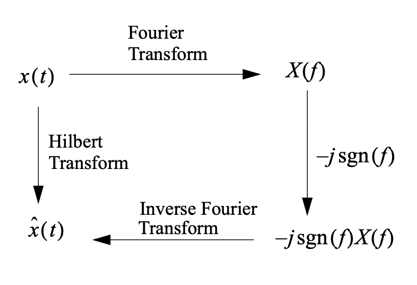

+++
date = '2025-09-07T22:03:53-04:00'
draft = false
title = 'ECE316 Formula'
+++

# ECE316 Formula

[See PDF Version](/lihaozhe-portfolio/documents/ECE316-Formula.pdf)

### Euler Indentities

$$
e^{j\theta} = \cos \theta + j \sin \theta, \quad \cos \theta = \frac{e^{j\theta} + e^{-j\theta}}{2}, \quad \sin \theta = \frac{e^{j\theta} - e^{-j\theta}}{2j}
$$

### Average Power & Energy

**Average Power** of a signal $x(t)$ is defined as
$$
P_x=\lim_{T\rightarrow \infty} \frac{1}{2T} \int_{-T}^{T} \abs{x^2(t)} dt
$$
**The energy** of $x(t)$ is
$$
E_x=\lim_{T \rightarrow \infty} \int_{-T}^{T} \abs{x^2(t)} dt = \int_{-\infty}^{\infty} \abs{x^2(t)} dt
$$

- $x(t)$ is an energy signal iff $0 \le E \lt \infty$; i.e. $x(t)$ has finite energy. （iff means if and only if）
- $x(t)$ is an power signal iff $0 \lt P \lt \infty$; i.e. $x(t)$ has finite power. Note that $E=\infty$ for power signals.

### Sinusoidal Signal

$$
x(t)=A cos(2\pi f_c t + \theta)
$$

where $A$ is amplitude, $f_c$ is frequency (in Hz), and $\theta$ is phase

### Fourier Series

$$
x(t) = \sum_{n=-\infty}^{\infty} X_n\phi_n(t)=\sum_{n=-\infty}^{\infty} X_n e^{j2\pi nf_0t}
$$

where $f_0 = \frac{1}{T}$.
$$
\int_{T_0} x(t)e^{-j2 \pi kf_0t} dt = T_0 X_k
$$
Derivation:
$$
\text{Both Sides} \times e^{-j2 \pi kf_0t}
$$

#### CTFS (from ECE216)
$$
x(t) = \sum_{k=-\infty}^{\infty} \alpha_k e^{j\omega_0 kt}, \quad \alpha_k = \frac{1}{T_0} \int_{T_0} x(t)e^{-j\omega_0 kt} dt, \quad \frac{1}{T_0} \|x\|^2 = \sum_{k=-\infty}^{\infty} |\alpha_k|^2
$$

### Angle Sum and Difference Identity

$$
\cos(A+B) = \cos(A)\cos(B) \mp \sin(A)\sin(B) \\
\sin(A+B) = \sin(A)\cos(B) \pm \cos(A)\sin(B)
$$

### **Sinc Function**

$$
\text{sinc}(x)=\frac{\sin(\pi x)}{\pi x}
$$

> Note that $\text{sinc}$ function have different definitions, in the course we use this definition.
### Parseval's Theorem

$$
P_x = \frac{1}{T_0} \int_{t_0}^{t_0+T_0} \abs{x(t)}^2  dt = \sum_{k=-\infty}^{\infty} \abs{X_K}^2
$$

### Rayleigh Energy Theorem

Rayleigh Energy Theorem is a continuous version of Parseval Theorem.

The **energy** of a signal \(g(t)\) is given by:

$$
E = \int_{-\infty}^{\infty} |g(t)|^2 \, dt = \int_{-\infty}^{\infty} |G(f)|^2 \, df
$$

(in Joules/Hz)

Let:

$$
\psi_g(f) = |G(f)|^2
$$

Then \( \psi_g(f) \) is called the **energy spectral density**, because the energy of \( g(t) \) equals:

$$
E = \int_{-\infty}^{\infty} \psi_g(f) \, df
$$

### Fourier Transform

Fourier Transform
$$
G(f) = \int_{-\infty}^{\infty} g(\lambda) e^{-j 2 \pi f \lambda} d\lambda
$$
Inverse Fourier Transform 
$$
g(t) = \int_{-\infty}^{\infty} G(f) e^{j 2 \pi f t} df
$$

where $\omega = 2 \pi f_0$, so can replace $2 \pi f_0$ with $\omega$. **BUT IN THIS FUCKING COURSE, THE TA SAID WE SHOULD USE $2 \pi f_0$...**

---

### Properties of the Fourier Transform

To simplify the calculation of Fourier transforms, we often use shortcuts based on the following properties:

#### 1. Superposition

$$
x_1(t) + x_2(t) \leftrightarrow X_1(f) + X_2(f)
$$

#### 2. Time Delay
$$
x(t - t_0) \leftrightarrow e^{-j2\pi f_0 t} X(f)
$$

#### 3. Scale Change
$$
x(at) \leftrightarrow \frac{1}{|a|} X\left(\frac{f}{a}\right)
$$

#### 4. Duality
$$
X(t) \leftrightarrow x(-f)
$$
> Think of a function in terms of its graph.

#### 5. Frequency Translation
$$
x(t) e^{j2\pi f_0 t} \leftrightarrow X(f - f_0)
$$

#### 6. Modulation
$$
x(t) \cos(2\pi f_0 t) \leftrightarrow \frac{1}{2} \left[ X(f - f_0) + X(f + f_0) \right]
$$

#### 7. Differentiation
$$
\frac{d}{dt}x(t) \leftrightarrow j2\pi f X(f)
$$

#### 8. Convolution
Time domain:
$$
x_1(t) * x_2(t) = \int_{-\infty}^{\infty} x_1(\tau) x_2(t - \tau) \, d\tau
$$

Frequency domain:
$$
x_1(t) * x_2(t) \leftrightarrow X_1(f) X_2(f)
$$

#### 9. Multiplication
$$
x_1(t) x_2(t) \leftrightarrow X_1(f) * X_2(f)
$$

#### 10. Delta Function

$$
\delta(t) \leftrightarrow 1
$$

#### 11. Complex Exponential

$$
e^{j 2 \pi f_0 t} \leftrightarrow \delta(f - f_0)
$$
#### 12. Area Property

> The area under a function in one domain equals the value of the function at zero in the other domain.

#### 13. Sinc Function

$$
\text{rect}(\frac{t}{T}) \leftrightarrow T \, \text{sinc}(T f)
$$

### Signal Bandwith

- **Strict bandwidth**: for signals whose spectrum restricted to some band, e.g. the sinc pulse, or a sum of sinusoids.

- **\- 3 dB bandwidth**: The range of frequencies over which the energy spectral density (or power spectral density for power signals) is within 3 dB of the maximum value. This is used mostly in electronic circuit design, e.g. amplifier design.
- **x% bandwidth (e.g. x=99)**. The minimum range of frequencies over which the area under the energy spectral density curve (or power spectral density curve) equals x % of the total area.
- **rms bandwidth** 
$$
B_{rms}=(\frac{\int_{-\infty}^{\infty} f^2 \abs{X(f)}^2 df}{\int_{-\infty}^{\infty} \abs{X(f)}^2 df})^{\frac{1}{2}} \, \text{Hz}
$$

### Time Duration of a Signal

$$
T_{rms}=(\frac{\int_{-\infty}^{\infty} t^2 \abs{x(t)}^2 dt}{\int_{-\infty}^{\infty} \abs{x(t)}^2 dt})^{\frac{1}{2}}
$$

For any signal with rms time duratin $T_{rms}$ and rms bandwidth $B_{rms}$ we have
$$
T_{rms} B_{rms} \ge \frac{1}{4 \pi}
$$

### Hilbert Transform

General Form from Google is
$$
H[f](x) = \frac{1}{\pi} \text{PV} \int_{-\infty}^{\infty} \frac{f(y)}{x-y} \, dy
$$

Hilbert transform of $x(t)$ is
$$
\hat{x}(t) = \sin(2 \pi f_0 t)
$$

#### Signum function

$$
\operatorname{sgn}(x) = \frac{x}{|x|}, \quad \text{for } x \neq 0 \\
$$

or
$$
\operatorname{sgn}(x) = 
\begin{cases} 
-1, & \text{if } x < 0 \\
0, & \text{if } x = 0 \\
1, & \text{if } x > 0 
\end{cases}
$$

### Linear Time Invariant Systems

$$
y(t) = h(t) * x(t) \\
Y(f) = H(f)X(f)
$$

Amplitude Response: $A(f) = \abs{H(f)}$

Phase Response: $\theta(f) = \arg(H(f))$

### Energy Spectral Density of a Signal

Energy Spectra:
$$
\psi_y(f) = \abs{H(f)}^2 \psi_x(f)
$$
