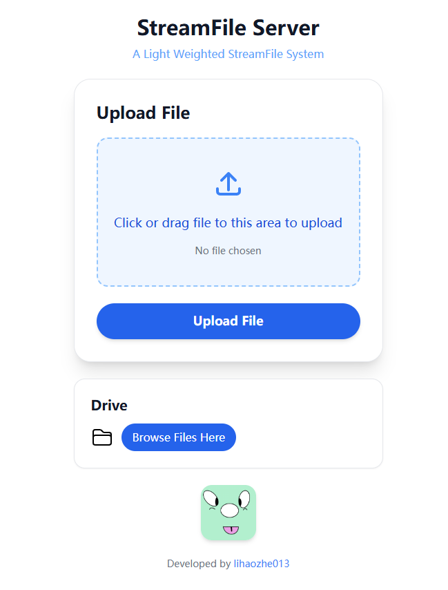
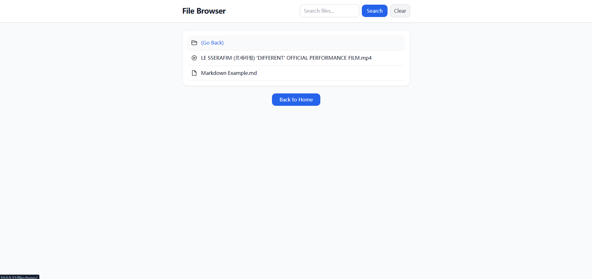
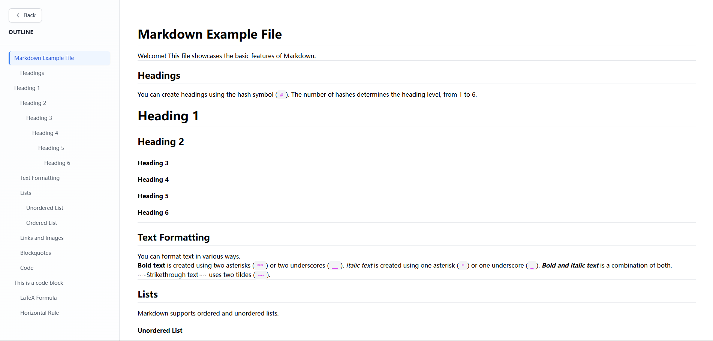
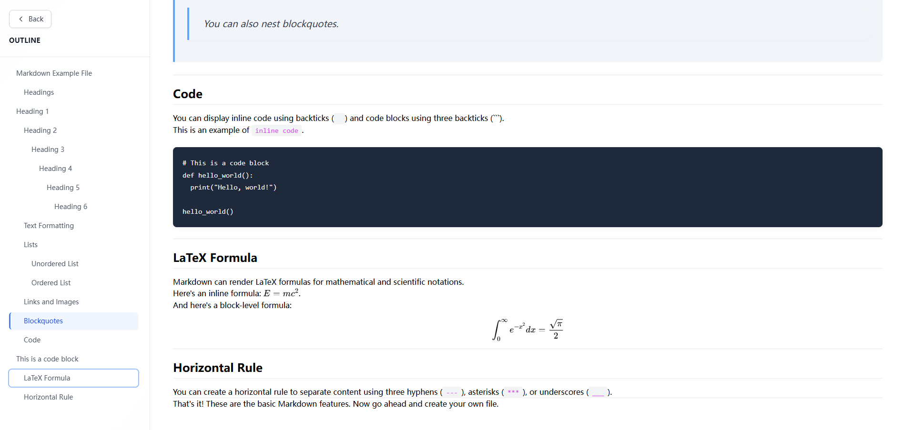
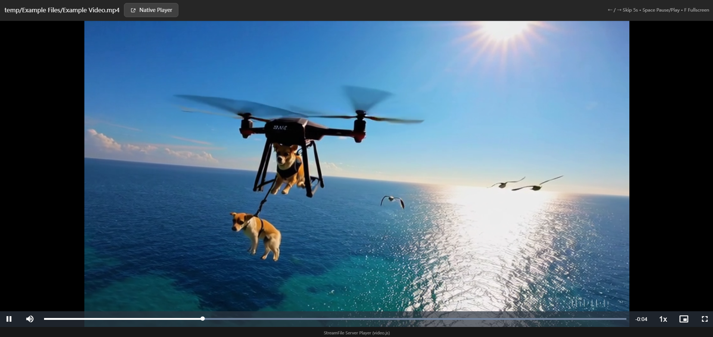
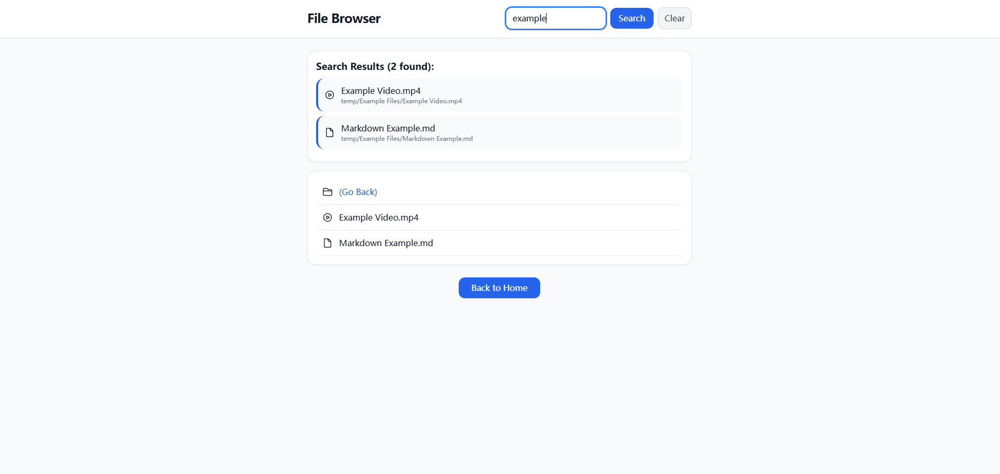

+++
date = '2025-09-13T22:03:53-04:00'
draft = false
title = 'StreamFile Server'
+++

# StreamFile Server: Personal Open Source Project

## GitHub
[https://github.com/lihaozhe013/streamfile-server-go](https://github.com/lihaozhe013/streamfile-server-go)

## Screenshots

## Features

**Search**

Users can search for files in the current directory and its subdirectories.

**File Upload**

User can upload files to the server, the uploaded files are not visible to other users and will only be released after permission is granted.

**Video Player**

A video player build by video.js.

**Markdown Rendering**

Markdown Content will be rendered.

**Log**

Can be enabled in config.yaml.

 

## Tech Stack

**Backend**
- Go
- Gin

 

**Frontend**
- TypeScript
- React
- React Router
- Video.js

## License

MIT License.
