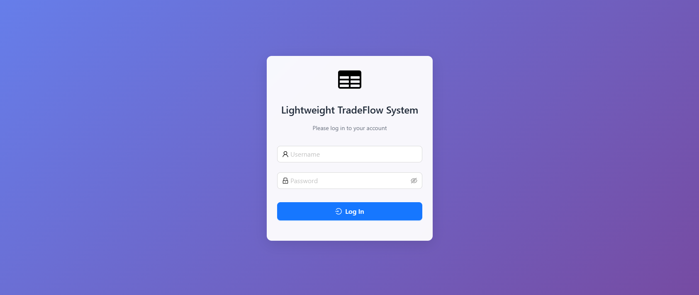
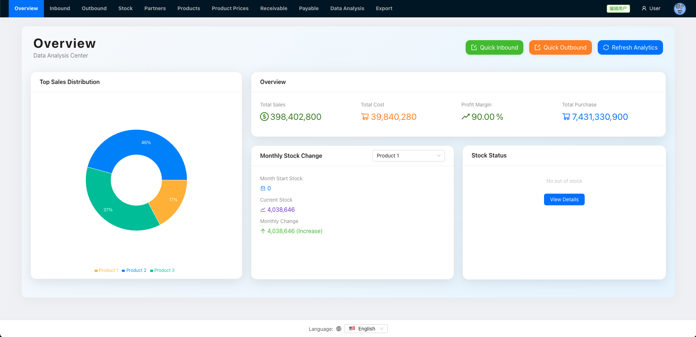
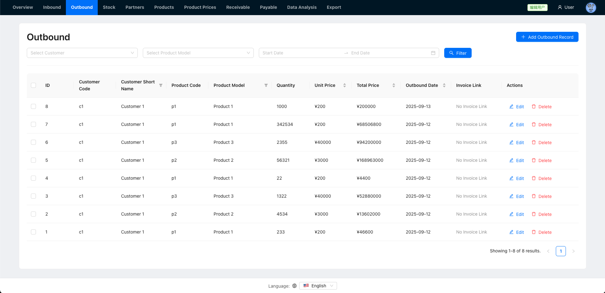
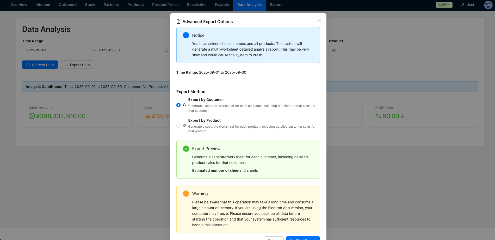
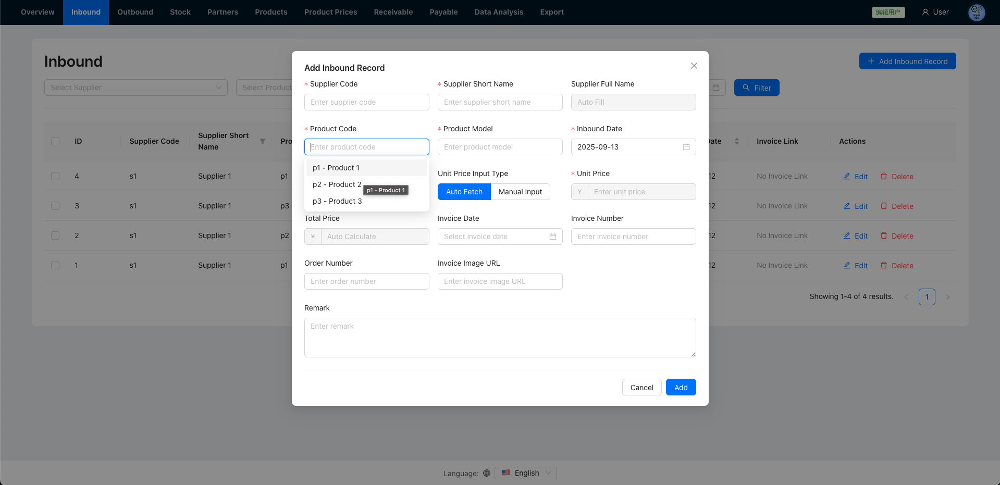

+++
date = '2025-09-13T00:00:00-00:00'
draft = false
title = 'TradeFlow System'
+++

# TradeFlow System: Personal Open Source Project

## [GitHub](https://github.com/lihaozhe013/myf-tradeflow-core)
## [Demo (Click Me)](https://haozheliexampleproject.xyz)

**Use the following info in the demo**:
> **Username**: user; **Password**: Thisistheuserpassword

## Screenshots

## Features

**Language Support**

English, Simplified Chinese, Korean

 

**Log**

Can be enabled in appConfig.json

 

**Stateless Authentication**

Can be enabled in appConfig.json

 

## Tech Stack

**Backend**

- Node.js
- SQLite

 

**Frontend**

- Vite
- React
- React Router 
- React i18next
- AntD

 

**Deployment Status**
- AlmaLinux
- Ubuntu LTS
- Nginx
- PM2

Successfully deployed on AWS Ubuntu LTS and AlmaLinux, using PM2 for concurrent requests handling, and Nginx as a reverse proxy server.

 

## Detailed Expeirence of This Project

The Challenge: Manual Processes and Financial Loss
In the summer of 2025, I developed a custom tradeflow software for a relative's integrated circuit (IC) sales company. As their business grew and product offerings became more customized, their manual, paper-based accounting methods became a significant liability. The company was experiencing repeated financial losses from undercharging clients, who then defaulted on payments. Their bookkeeping process, managed by an employee with only basic Excel skills, was unable to handle the complexity of variable pricing for different clients and products over time.

My Solution: A Custom Software Proposal
After observing their workflow and conducting extensive interviews with their sales team, I identified the key pain points and proposed a custom software solution. To help them visualize the end product, I created a detailed proposal that included software interface mockups designed in Figma. My goal was to build an intuitive system that would automate their invoicing and record-keeping, preventing future errors and financial leakage. Although initially skeptical because commercial ERP systems were too expensive, they agreed to let me develop a prototype at no cost.

Development and Initial Impact
For the initial prototype, I chose a technology stack well-suited for a low-concurrency business application: Node.js for the backend, SQLite for the database, and React.js with the Ant Design UI library for a professional frontend.
The prototype was a complete success. It solved their core problem by allowing sales staff to simply enter an order's date, client, and product name to automatically retrieve the correct, pre-set price. This eliminated invoicing errors. The system also streamlined their workflow by enabling them to log new orders and update their status to "shipped" in real-time, replacing unreliable spreadsheets and saving significant administrative overhead.

Scaling for Production and New Requirements
Impressed by the results, the company decided to fund the project's full development and deployment. They requested several key enhancements to turn the prototype into a production-ready system:
Cloud Deployment: To allow salespeople to access the system and add new orders from anywhere.
User Management: To create distinct user accounts with different permission levels, including read-only access for external partners.
System Logging: To track user activity and application events for internal accountability.

Cloud Architecture and DevOps
To deliver these features, I deployed the application to the cloud. I set up a pre-production environment on Amazon Web Services (AWS) for testing and a production environment on Alibaba Cloud to best serve their users in China. I configured Nginx as a reverse proxy for the application.
Furthermore, I established a modern DevOps pipeline using GitHub Actions. This new workflow automatically built the application every time I pushed new code. From there, I could use a simple script to pull the latest build and deploy it to the live environment, ensuring smooth and rapid updates.

Outcome and Key Learnings
The system was fully tested and officially launched in September 2025. It successfully solved the company's financial pain points and introduced them to a more efficient, modern workflow.
For me, this project was an invaluable end-to-end experience. I moved from user research and requirements gathering to full-stack development, cloud deployment, and CI/CD implementation. It gave me a clear understanding of how to build and launch enterprise-level software that delivers tangible business value.

## License

MIT License.
