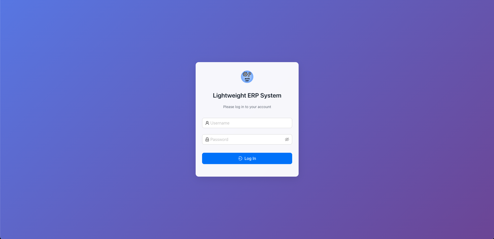
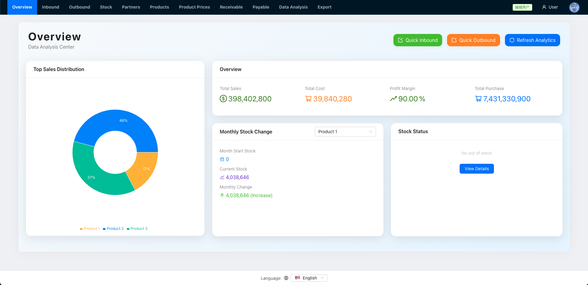
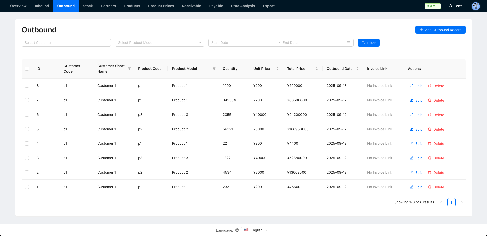
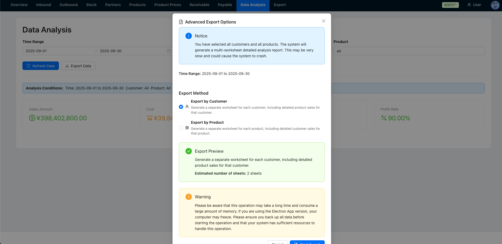
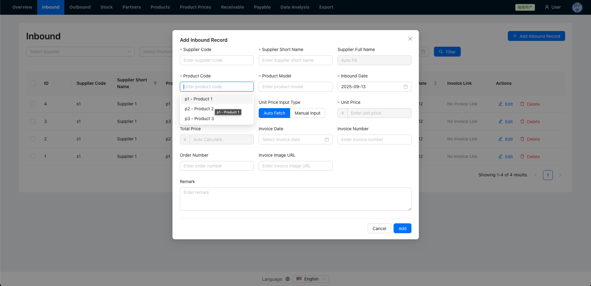

+++
date = '2025-09-13T22:03:53-04:00'
draft = false
title = 'Simple ERP System'
+++

# SIMPLE ERP SYSTEM

## [GitHub](https://github.com/lihaozhe013/myf-lightweight-ERP-system)
## [Demo (Click Me)](https://haozheliexampleproject.xyz)

**Use the following info in the demo**:
> **Username**: user; **Password**: Thisistheuserpassword

## Screenshots

## Features

**Language Support**

English, Simplified Chinese, Korean

 

**Log**

Can be enabled in appConfig.json

 

**Stateless Authentication**

Can be enabled in appConfig.json

 

## Tech Stack

**Backend**
>
- Node.js
- SQLite

 

**Frontend**
>
- Vite
- React
- React Router 
- React i18next
- AntD

 

**Prod**
>
- Ubuntu LTS
- Nginx
- PM2

 

## License

MIT License.
